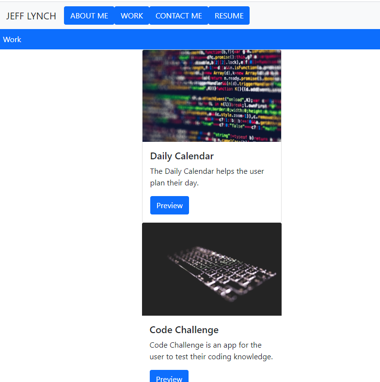

# reactPortfolio

## Description

This project is an insight to my portfolio of my professional accomplishments.

##Link

https://kingami34.github.io/reactPortfolio/

## Table of Contents (Optional)

- [Installation](#installation)

- [Class](#class)

- [Usage](#usage)

- [License](#license)

## Installation

>The first thing uploaded npx create-react-app my-app to VS code.

>Set-up HTML and style css to give an outline to this project.

>Add an HTML cover page to give the project a more professional look.

## Usage

## License

--- web app hosted on GitHub

